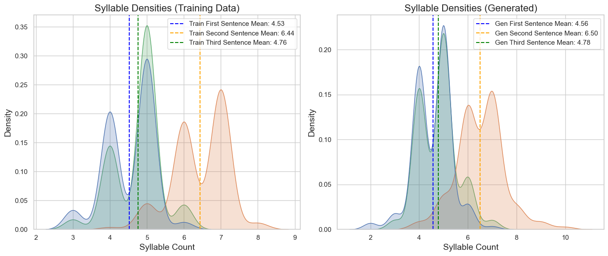
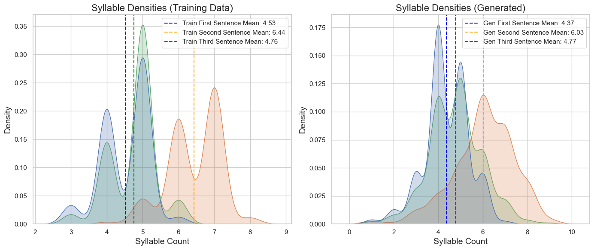
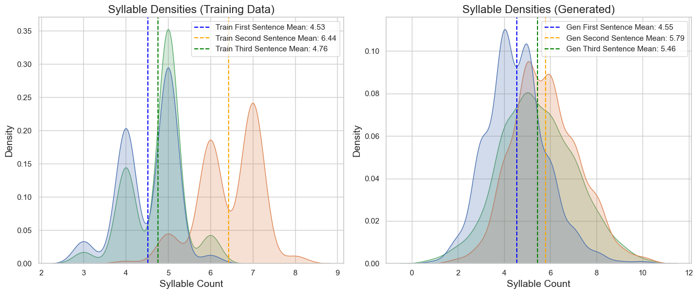

# HaikuLLMTransformer

Built using just the decoder part of the model described in <a href="https://arxiv.org/abs/1706.03762">Attention is All You Need</a>. The model structure is shown below

Goal: Make a text generator that can maintain some of the structure in the dataset and formulate real words.

The dataset used was statworx/haiku from huggingface. The dataset consists of mostly haikus in the 5-7-5 syllable structure, but there are many unstructured 3 line poems in the mix, so the aim of the generator will be mostly to produce legable 3 line poems, separated by "/" between the lines and "\n" or a new line for new poems.

pytorch version 2.1.2

The first run through was using a very simple tokenization strategy, simply translating the different characters from the dataset into number. These files are specified with the suffix SimpleEncode. I have additionally tested using a Regex tokenizer for splitting words using apostrophes, hyphens, etc. and created combined tokens for common patters. Below I kept track of the differences.

## Text Output

</head>
<body>
    

        

            <h3>Simple Tokenizer</h2>
            
Is so setting faith? / U'll always happy I'll pron. / You and eat on daw.' 
                Will surprised?\nSnowfall. / The sclimber of wine. / Only spectaculates. 
                Blinding. / The dunes sheds. / Calhed roses. 
                One last gum. / The begin speaks. / Darkness. 
                A long on threads. / One book only mango. / The dog. 
                Half pilleting. / Of thoughts leave. / Sinsing the quilt. 
                [Eliter] / Feeling my elophone home. / Wilding persons. 
                Pale thunder. / The pie. / Of wet patching. 
                Soft chargazes. / The twilight catch comes kiss. / Half, the sunfire shine. 
                Remember Sharp notes. / Returned the ocean. / A rising down. 
                

        

        

            <h3>Regex Tokenizer with 1000 token size</h2>
            
The world is unright. / Haiku therapy. / Taste of anama. 
                Mirror, envy dewgs. / Where ait spells lied? 
                My dog kayoffs to. / Those who am I still alive. / An accidental legs. 
                Near of refuseddit. / The water dust. / The lingering sun. 
                Rivering heat. / My air turns clapped. / On the cashiernewbe. 
                A dark chains collect. / On Christmas standard. / Hurry. 
                Bult of Aard. / Drimy hand on my face. 
                Sweet wintery. / Evide. / My heart boxes, catches a mxsport. 
                Another stood. / In Towiti if noticer. / Looks wrapped at work. 
                The words are shower. / Early flated the sky. / All that will lack of life.

        

        

            <h3>Regex Tokenizer with 3000 token size</h2>
            
Is so setting faith? / U'll always happy I'll pron. / You and eat on daw. 
                Getting the one, Yuk. / Everything I'm short is. / Everything good to. 
                No wig awful, R. / So much I remember. / If you pout to ship. 
                Memes about my heart. / Bad is even no gas? / Do nothing somebody. 
                Sunday shiny drop. / Parting hards of the wisel? / Even the boys like. 
                Shit was the pierced. / Off, Luck ugly, I remind. / It is enjoy your door. 
                Beautiful rearing. / Stop never ending running. / Blockstors, from itself. 
                A child's time hours. / The snowfall ripping heavy up. / And fillend messions. 
                Oh, babe, I'm home. / Here foreading why you're Not? / The folded, let's busy. 
                Then I wope I looking. / Today and got to win this. / Til I'll really wish. 
            

        

    

</body>

## Syllable Counts

Simple Encoding Tokenizer             | Regex Tokenizer with 1000 Length             |  Regex Tokenizer with 3000 Length
:-------------------------:|:-------------------------:|:-------------------------:
  |   |  

